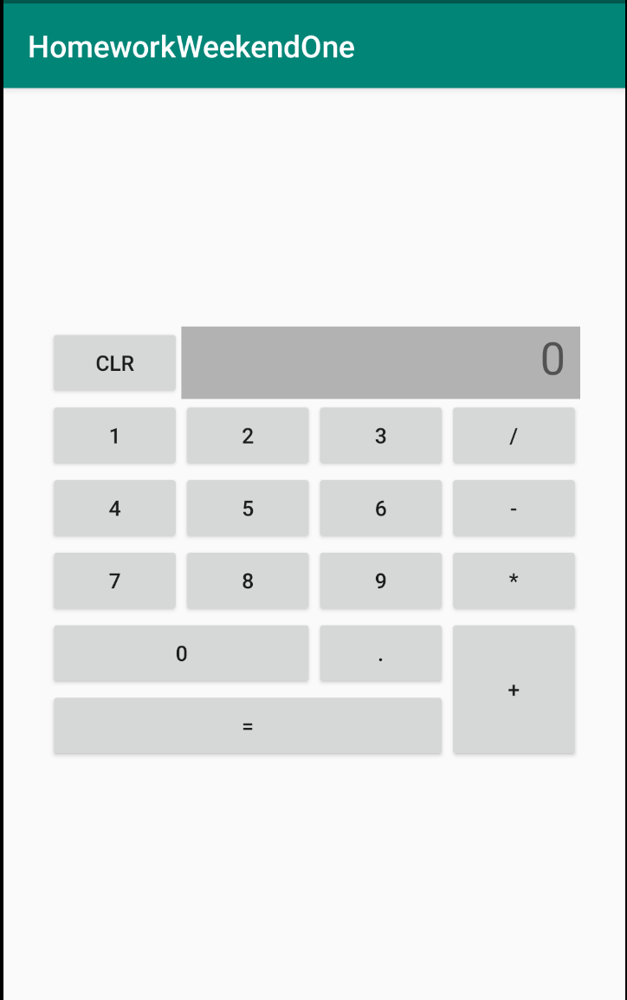
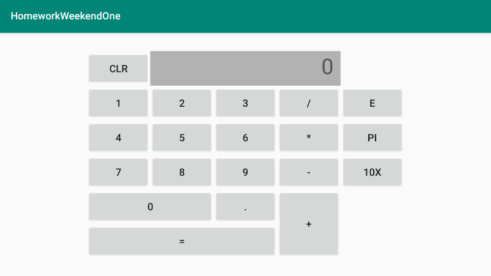

# HomeworkWeekendOne

Research

1. What is the difference in Dalvik and ART

2. What is the DEX Limit?

3. What are launch modes?

4. What are form factors?

5. What are Layout Qualifiers

Coding

Create a calculator app to perform all the 
standard calculator operations like addition, subtraction, multiplication, divide etc. 

 
 
